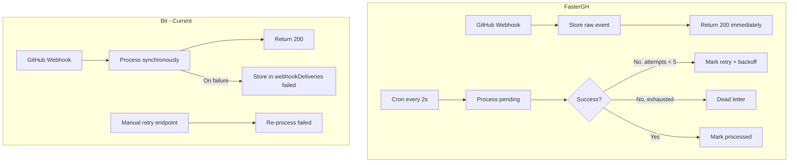

# FasterGH Adoption Roadmap for Bit

## Executive Summary

FasterGH demonstrates production-proven patterns that would significantly improve Bit's reliability, performance, and maintainability. This plan consolidates learnings from three comparisons into a single prioritized roadmap. The highest-impact changes: async webhook processing with retry, three-layer data model, and sync job queues.

---

## Architecture: Webhook Processing



**Bit improvements:**

- Store raw payload immediately, return 200, process in background. Reduces GitHub timeout and duplicate sends.
- Automatic retry with exponential backoff instead of manual retry only.
- Dead-letter table after N retries for manual inspection.

---

## Three-Layer Data Architecture

**FasterGH:** Raw Webhooks → Normalized Domain Tables → Projection Views

- Raw ingestion: Store webhook events verbatim for audit/replay.
- Normalized domain tables: Proper foreign keys and relationships.
- Projection views: Pre-computed read views (e.g. `view_activity_feed`) for fast queries.

**Bit:** Direct storage into entity tables from webhooks; no separation; client-side filtering.

**Improvements:**

1. Add `rawWebhookEvents` table for unprocessed payloads.
2. Create `activityFeed` projection table for dashboard queries.
3. Separate sync state from entity state.

---

## Detailed Comparison

### 1. Webhook Processing

| Aspect        | FasterGH                            | Bit                                  |
| ------------- | ----------------------------------- | ------------------------------------ |
| Processing    | Async via cron every 2s             | Synchronous in HTTP handler          |
| Retry         | Exponential backoff, max 5 attempts | Manual retry only                    |
| Dead-letter   | Separate table after exhaustion     | Stored in `webhookDeliveries` failed |
| Deduplication | Delivery ID built-in                | `webhookDeliveries` by deliveryId    |

### 2. Rate Limit and Error Handling

**FasterGH:** Tagged errors (`GitHubApiError`, `GitHubRateLimitError` with `retryAfterMs`); callers can `catchTag`.

**Bit:** `withRateLimitRetry` with backoff + jitter; errors not typed; callers cannot distinguish rate limit from other 403s.

**Improvement:** Add `GitHubRateLimitError` class with `retryAfterMs` so API routes return `{ error, retryAfter }` to the client.

### 3. Observability and Logging

**FasterGH:** OpenTelemetry, Sentry, Axiom; structured `console.info` with counts; Effect spans.

**Bit:** `console.log` / `console.error`; no structured logging, tracing, or metrics.

**Improvement:** Structured JSON logger with `{ event, deliveryId, duration, error }`; log webhook outcomes (processed, failed, retried).

### 4. CI/CD Event Handling

**FasterGH:** `check_run`, `workflow_run`, `workflow_job` implemented; UI shows CI status on PRs.

**Bit:** Stubs only; no persistence.

**Improvement:** Implement handlers for `check_run` and `workflow_run`; persist and surface in PR UI.

### 5. Lenient Decoding and Partial Failures

**FasterGH:** `decodeLenientArray()` for paginated responses; returns `{ parsed, skipped }`; one bad item does not fail the whole sync.

**Bit:** Direct parsing; single malformed item fails entire operation.

**Improvement:** Lenient parsing for list endpoints; collect valid items, log/skip invalid ones.

### 6. Optimistic Updates for Writes

**FasterGH:** `optimisticState: "pending"` → webhook confirms → `"confirmed"`; immediate UI feedback.

**Bit:** No write operations yet; no optimistic pattern.

**Improvement:** When adding writes, use state machine: `optimisticState`, `optimisticCorrelationId`, `optimisticError`.

### 7. Auth Token Refresh

**FasterGH:** `executeWithAuthRefreshRetry`; on auth failure, refreshes token and retries.

**Bit:** `handleGitHubAuthError` marks token invalid; user must reconnect.

**Improvement:** Retry-on-refresh before marking token invalid (depends on InstantDB auth capabilities).

### 8. Schema and Validation

**FasterGH:** Effect Schema at API boundaries; `Schema.decodeUnknownEither`; coercion helpers.

**Bit:** Type assertions; ad-hoc extraction; some `any` in webhook handlers.

**Improvement:** Runtime validation (Zod or Effect Schema) at handler boundaries.

### 9. Sync Job Architecture

**FasterGH:** Job queue with priority, lock keys, step tracking (`currentStep`, `completedSteps`, `itemsFetched`), cursor-based pagination.

**Bit:** Sync state per resource type; no job queue or step tracking.

**Improvement:** Add `syncJobs` entity with `jobType`, `state`, `currentStep`, `priority`, `nextRunAt`.

### 10. Operational Visibility

**FasterGH:** `getQueueHealth`, `systemStatus`, admin dashboard.

**Bit:** No admin/health view for webhook queue.

**Improvement:** Admin endpoint with `webhookDeliveries` by status, failed count, last processed timestamp.

---

## What Bit Already Does Well

- **Duplicate detection:** Checks `webhookDeliveries` by `deliveryId` before processing.
- **Retry mechanism:** Manual retry for failed webhooks with stored payload.
- **Rate limit retry:** `withRateLimitRetry` with exponential backoff and jitter.
- **Auth error handling:** Marks token invalid and surfaces user-friendly message.
- **Separation of concerns:** API handlers extracted for testability; webhook handlers modular.
- **AGENTS.md:** Clear conventions for React, InstantDB, TanStack Router.

---

## Priority Recommendations

| Priority   | Improvement                               | Effort | Impact                         |
| ---------- | ----------------------------------------- | ------ | ------------------------------ |
| **High**   | Async webhook queue with retry            | Medium | Reliability, no dropped events |
| **High**   | Automatic retry + dead-letter             | Medium | Avoids manual intervention     |
| **High**   | Projection views for dashboard            | Medium | Performance, faster queries    |
| **Medium** | Sync job queue with steps                 | Medium | Better UX, progress visibility |
| **Medium** | Raw webhook storage                       | Low    | Audit trail, replay capability |
| **Medium** | Typed rate limit errors                   | Low    | Client feedback on retry       |
| **Medium** | Webhook payload validation                | Low    | Reduces runtime errors         |
| **Medium** | CI/CD events (check_run, workflow_run)    | Medium | PR status completeness         |
| **Medium** | Integration tests for webhooks            | Medium | Confidence in invariants       |
| **Medium** | Structured logging                        | Low    | Operational visibility         |
| **Medium** | Lenient decoding                          | Low    | Resilient sync                 |
| **Low**    | Optimistic writes (when adding mutations) | High   | Better UX, offline support     |
| **Low**    | Token lifecycle recovery                  | Medium | Fewer manual reconnects        |
| **Low**    | Admin/queue health endpoint               | Low    | Operational visibility         |
| **Low**    | Notification polling                      | Medium | Feature parity                 |
| **Low**    | File read tracking                        | Low    | UX improvement                 |

---

## High-Impact Work Sequence

1. **Reliability foundation**

- Add webhook job state (`pending`, `retry`, `failed`, `processed`) and retry metadata.
- Introduce background processor with exponential backoff and jitter.
- Keep current failed-payload storage as dead-letter fallback.

1. **PR status completeness**

- Implement `check_run`, `check_suite`, `status`, `workflow_run` handling.
- Persist status entities and wire into PR detail views.

1. **Issue/review parity**

- Complete issue/review/comment lifecycle webhook paths.
- Ensure idempotent upserts and stale-event protection.

1. **Token lifecycle hardening**

- Add proactive token validity checks and graceful refresh/reconnect flow.

1. **Confidence via tests**

- Add integration tests for out-of-order events, duplicate deliveries, and retry behavior.

---

## Schema Additions (Reference)

```typescript
// Webhook queue
webhookQueue: i.entity({
  deliveryId: i.string().unique().indexed(),
  event: i.string(),
  payload: i.string(),
  status: i.string().indexed(), // pending, processing, failed, completed
  attempts: i.number(),
  nextRetryAt: i.number().optional().indexed(),
  error: i.string().optional(),
  createdAt: i.number(),
  processedAt: i.number().optional(),
})

// Sync jobs
syncJobs: i.entity({
  jobType: i.string(),
  resourceType: i.string(),
  resourceId: i.string(),
  state: i.string().indexed(),
  currentStep: i.string().optional(),
  completedSteps: i.string().optional(),
  itemsFetched: i.number().optional(),
  attempts: i.number(),
  priority: i.number().indexed(),
  nextRunAt: i.number().indexed(),
  error: i.string().optional(),
})

// Optimistic writes (when adding mutations)
// Add to pullRequests/issues: optimisticState, optimisticCorrelationId, optimisticError

// File read state (optional)
fileReadState: i.entity({
  userId: i.string().indexed(),
  repoId: i.string().indexed(),
  filePath: i.string().indexed(),
  fileSha: i.string(),
  readAt: i.number(),
})
```

---

## First Files to Target

- **Reliability/sync core:** `src/routes/api/github/webhook.ts`, `src/lib/github-client.ts`, `src/lib/sync-state.ts`
- **Data model:** `src/instant.schema.ts`
- **PR UI:** `src/routes/$owner/$repo/pull.$number.tsx`, PR detail components
- **Validation/tests:** `src/lib/test-helpers.ts`, `src/lib/*.test.ts`

---

## Success Criteria

- PR pages show accurate live check/run status.
- Duplicate and out-of-order webhooks no longer create stale writes.
- Failed webhook deliveries retry automatically and are observable.
- Token expiration creates recoverable UX, not silent sync degradation.
- Integration tests cover core sync invariants (idempotency, ordering, retry).
