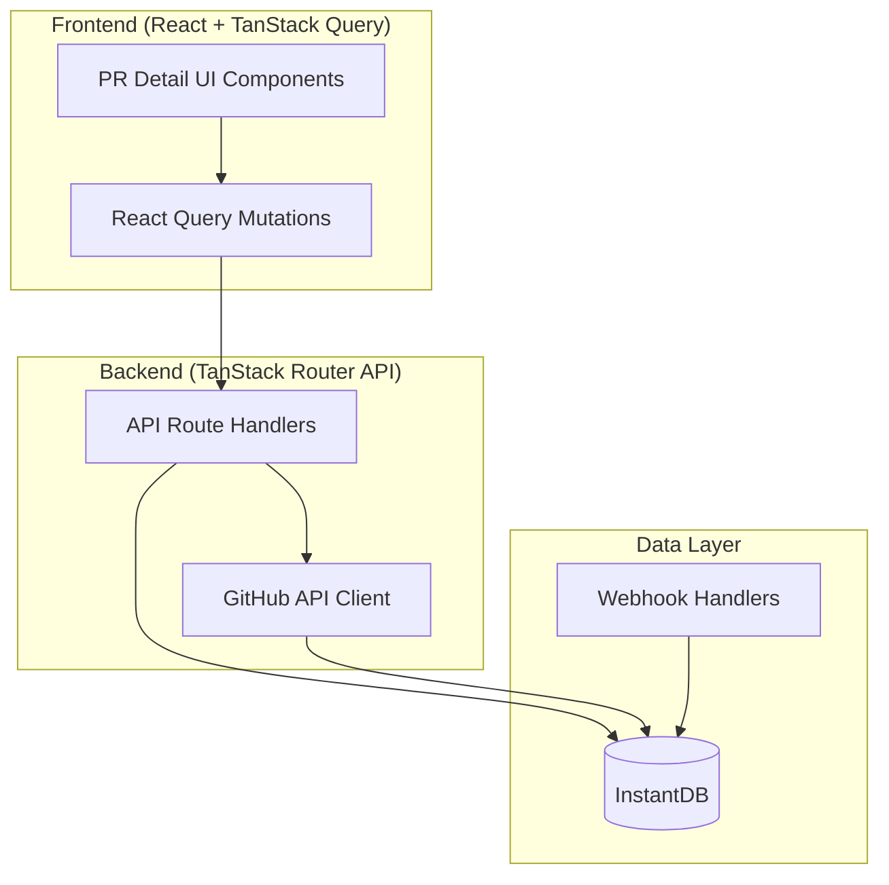

# PR Features Implementation Plan

This plan implements all missing GitHub pull request features in 6 phases. Each phase builds on the previous and includes comprehensive test coverage.

## Architecture Overview



---

## Phase 1: Core PR Actions (Foundation)

**Priority: Critical | Estimated: 2-3 days**

### 1.1 Merge PR

**Files to modify/create:**

- `src/routes/api/github/pr/merge.ts` - New API route
  - POST endpoint for merging PRs
  - Support merge methods: `merge`, `squash`, `rebase`
  - Accept optional `commit_title` and `commit_message`
  - Handle merge conflicts and error cases
  - Update local PR state after successful merge
- `src/lib/github-client.ts` - Add `mergePullRequest()` function
  - Call GitHub API: `POST /repos/{owner}/{repo}/pulls/{pull_number}/merge`
  - Handle all error responses (405 merge conflict, 404 not found, etc.)
- `src/lib/mutations.ts` - Add `mergePRMutation`
  - React Query mutation for merge action
  - Invalidate PR queries on success
- `src/features/pr/PRActionsBar.tsx` - New component
  - Merge button with method selection dropdown
  - Conflict warning indicator
  - Shows branch protection status
- `src/lib/webhooks/pull-request.ts` - Update handler
  - Ensure `closed` action with `merged=true` updates local state

**Test coverage:**

- `src/routes/api/github/pr/merge.test.ts`
  - Happy path: successful merge
  - Error: merge conflict (405)
  - Error: PR not mergeable
  - Error: unauthorized
  - Each merge method (merge/squash/rebase)
- `src/lib/github-client.test.ts`
  - Mock GitHub API responses

### 1.2 Close/Reopen PR

**Files to modify/create:**

- `src/routes/api/github/pr/state.ts` - New API route
  - PATCH endpoint for updating PR state
  - Support `state: "open" | "closed"`
- `src/lib/github-client.ts` - Add `updatePullRequestState()` function
  - Call GitHub API: `PATCH /repos/{owner}/{repo}/pulls/{pull_number}`
- `src/lib/mutations.ts` - Add `updatePRStateMutation`
- `src/features/pr/PRActionsBar.tsx` - Update
  - Close/Reopen button
  - State indicator

**Test coverage:**

- `src/routes/api/github/pr/state.test.ts`
  - Close PR
  - Reopen PR
  - Error cases

### 1.3 Delete/Restore Source Branch

**Files to modify/create:**

- `src/routes/api/github/branch.ts` - New API route
  - DELETE endpoint to delete branch
  - POST endpoint to restore deleted branch (via Git reflog)
- `src/lib/github-client.ts` - Add branch management functions
  - `deleteBranch()`: `DELETE /repos/{owner}/{repo}/git/refs/heads/{branch}`
  - `restoreBranch()`: Create ref from SHA
- `src/features/pr/PRActionsBar.tsx` - Update
  - Delete branch button (shown after merge)
  - Restore button for recently deleted branches

**Test coverage:**

- `src/routes/api/github/branch.test.ts`
  - Delete branch
  - Restore branch
  - Error: branch not found
  - Error: branch has open PRs

---

## Phase 2: Comments & Reviews (Collaboration)

**Priority: High | Estimated: 3-4 days**

### 2.1 Add Conversation Comments

**Files to modify/create:**

- `src/routes/api/github/comments.ts` - New API route
  - POST endpoint: create issue comment
  - PATCH endpoint: edit comment
  - DELETE endpoint: delete comment
- `src/lib/github-client.ts` - Add comment functions
  - `createIssueComment()`: `POST /repos/{owner}/{repo}/issues/{number}/comments`
  - `updateIssueComment()`: `PATCH /repos/{owner}/{repo}/issues/comments/{id}`
  - `deleteIssueComment()`: `DELETE /repos/{owner}/{repo}/issues/comments/{id}`
- `src/lib/mutations.ts` - Add comment mutations
  - `createCommentMutation`
  - `updateCommentMutation`
  - `deleteCommentMutation`
- `src/features/pr/CommentComposer.tsx` - New component
  - Textarea with markdown preview
  - Submit/cancel buttons
  - Loading state
- `src/features/pr/PRActivityFeed.tsx` - Update
  - Replace "Add comment" placeholder with actual composer
- `src/lib/webhooks/comment.ts` - Update (already handles `issue_comment`)
  - Ensure create/edit/delete actions update InstantDB

**Test coverage:**

- `src/routes/api/github/comments.test.ts`
  - Create comment
  - Edit comment
  - Delete comment
  - Not found errors
- `src/lib/github-client.test.ts`
  - Comment API calls

### 2.2 Submit Reviews

**Files to modify/create:**

- `src/routes/api/github/reviews.ts` - New API route
  - POST endpoint: submit PR review
  - Support event types: `APPROVE`, `REQUEST_CHANGES`, `COMMENT`
  - Optional body text
- `src/lib/github-client.ts` - Add review functions
  - `createPullRequestReview()`: `POST /repos/{owner}/{repo}/pulls/{number}/reviews`
  - `submitPullRequestReview()`: `POST /repos/{owner}/{repo}/pulls/{number}/reviews/{id}/events`
- `src/lib/mutations.ts` - Add review mutations
  - `submitReviewMutation`
- `src/features/pr/ReviewComposer.tsx` - New component
  - Review state selector (Approve/Request Changes/Comment)
  - Body text input
  - Submit button with state indicator
- `src/features/pr/PRActivityFeed.tsx` - Update
  - Show review composer
- `src/lib/webhooks/pull-request-review.ts` - Update
  - Ensure `submitted` action creates review record

**Test coverage:**

- `src/routes/api/github/reviews.test.ts`
  - Approve PR
  - Request changes
  - Comment review
  - Error: already reviewed

### 2.3 Add Inline Review Comments

**Files to modify/create:**

- `src/routes/api/github/review-comments.ts` - New API route
  - POST endpoint: create review comment on specific line
  - Support: `path`, `line`, `side`, `commit_id`, `in_reply_to`
- `src/lib/github-client.ts` - Add function
  - `createReviewComment()`: `POST /repos/{owner}/{repo}/pulls/{number}/comments`
- `src/lib/mutations.ts` - Add mutation
  - `createReviewCommentMutation`
- `src/features/pr/DiffViewer.tsx` - Update
  - Replace "Add comment" placeholder with functional button
  - Click line number to add comment
  - Inline comment input form
- `src/lib/webhooks/comment.ts` - Update
  - Ensure `pull_request_review_comment` handled

**Test coverage:**

- `src/routes/api/github/review-comments.test.ts`
  - Create inline comment
  - Create reply to existing comment
  - Error: invalid line number

### 2.4 Resolve Conversation Threads

**Files to modify/create:**

- `src/routes/api/github/resolve.ts` - New API route
  - POST: resolve conversation
  - DELETE: unresolve conversation
- `src/lib/github-client.ts` - Add function
  - `updateReviewComment()`: `PATCH /repos/{owner}/{repo}/pulls/comments/{id}`
  - Include `resolved` field in body
- `src/lib/mutations.ts` - Add mutations
  - `resolveThreadMutation`
  - `unresolveThreadMutation`
- `src/features/pr/CommentThread.tsx` - New component (or update existing)
  - Resolve/unresolve button on threads
  - Visual indicator for resolved state

**Test coverage:**

- `src/routes/api/github/resolve.test.ts`

---

## Phase 3: Review Enhancements

**Priority: Medium-High | Estimated: 2-3 days**

### 3.1 Suggest Changes (Code Suggestions)

**Files to modify/create:**

- `src/routes/api/github/suggestions.ts` - New API route
  - POST: create suggestion comment with `suggestion` body format
- `src/lib/github-client.ts` - Add helper
  - `createSuggestedChange()` - Formats body with

````suggestion code blocks

- `src/features/pr/SuggestionBlock.tsx` - New component
  - Render suggestions in diff view
  - Show "Apply suggestion" button (if you have write access)
  - Diff preview of suggestion

- `src/features/pr/DiffViewer.tsx` - Update
  - Add "Suggest changes" mode to inline comment composer

**Test coverage:**
- `src/routes/api/github/suggestions.test.ts`
- `src/lib/github-client.test.ts` (suggestion formatting)

### 3.2 Draft Review State
**Files to modify/create:**

- `src/routes/api/github/reviews.ts` - Update
  - Support `draft` parameter when creating reviews

- `src/lib/mutations.ts` - Add mutations
  - `createDraftReviewMutation`
  - `submitDraftReviewMutation`
  - `discardDraftReviewMutation`

- `src/features/pr/ReviewComposer.tsx` - Update
  - "Start review" button (creates draft)
  - "Finish your review" button
  - "Discard review" button
  - Pending review indicator

**Test coverage:**
- `src/routes/api/github/reviews.test.ts` (draft scenarios)

### 3.3 Mark Files as Viewed
**Files to modify/create:**

- `src/routes/api/github/viewed.ts` - New API route
  - POST: mark file as viewed
  - DELETE: mark as unviewed

- `src/lib/github-client.ts` - Add function
  - Use GraphQL API (v4) or REST custom endpoint
  - GitHub's REST API doesn't expose this directly - may need to track locally

- `src/lib/mutations.ts` - Add mutation
  - `toggleFileViewedMutation`

- `src/features/pr/PRFilesTab.tsx` - Update
  - Checkbox next to each file: "Viewed"
  - Progress indicator (X of Y files viewed)
  - Filter to show only unviewed files

**Test coverage:**
- Since this uses local state or GraphQL, test the UI logic
- `src/lib/pr-viewed-files.test.ts` (utility for tracking viewed state)

### 3.4 Re-request Review
**Files to modify/create:**

- `src/routes/api/github/reviews.ts` - Update
  - POST endpoint to re-request review from specific users

- `src/lib/github-client.ts` - Add function
  - `requestReviewers()`: `POST /repos/{owner}/{repo}/pulls/{number}/requested_reviewers`

- `src/lib/mutations.ts` - Add mutation
  - `reRequestReviewMutation`

- `src/features/pr/PRActivityFeed.tsx` - Update
  - "Re-request" button on existing reviews

**Test coverage:**
- `src/routes/api/github/reviews.test.ts`

---

## Phase 4: PR Management
**Priority: Medium | Estimated: 2-3 days**

### 4.1 Edit PR Title/Description
**Files to modify/create:**

- `src/routes/api/github/pr/update.ts` - New API route
  - PATCH: update title and/or body

- `src/lib/github-client.ts` - Add function
  - `updatePullRequest()`: `PATCH /repos/{owner}/{repo}/pulls/{number}`

- `src/lib/mutations.ts` - Add mutation
  - `updatePRMutation`

- `src/features/pr/PRHeader.tsx` - New component (extract from page)
  - Inline editable title (click to edit)
  - Markdown editor for description
  - Save/cancel buttons

**Test coverage:**
- `src/routes/api/github/pr/update.test.ts`

### 4.2 Assign Reviewers
**Files to modify/create:**

- `src/routes/api/github/pr/reviewers.ts` - New API route
  - POST: add requested reviewers
  - DELETE: remove requested reviewers

- `src/lib/github-client.ts` - Add function
  - `requestReviewers()`: Already defined above
  - `removeRequestedReviewers()`: `DELETE /repos/{owner}/{repo}/pulls/{number}/requested_reviewers`

- `src/lib/mutations.ts` - Add mutations
  - `addReviewersMutation`
  - `removeReviewersMutation`

- `src/features/pr/ReviewerPicker.tsx` - New component
  - Multi-select dropdown for users/teams
  - Shows current reviewers with remove button
  - Search/filter by login/name

**Test coverage:**
- `src/routes/api/github/pr/reviewers.test.ts`

### 4.3 Add/Remove Labels
**Files to modify/create:**

- `src/routes/api/github/pr/labels.ts` - New API route
  - POST: add labels to PR
  - DELETE: remove labels from PR
  - PUT: set labels (replace all)

- `src/lib/github-client.ts` - Add functions
  - `addLabels()`: `POST /repos/{owner}/{repo}/issues/{number}/labels`
  - `removeLabel()`: `DELETE /repos/{owner}/{repo}/issues/{number}/labels/{name}`
  - `setLabels()`: `PUT /repos/{owner}/{repo}/issues/{number}/labels`

- `src/lib/mutations.ts` - Add mutations
  - `addLabelsMutation`
  - `removeLabelMutation`
  - `setLabelsMutation`

- `src/features/pr/LabelPicker.tsx` - New component
  - Color-coded label chips
  - Dropdown with repo labels list
  - Create new label option

**Test coverage:**
- `src/routes/api/github/pr/labels.test.ts`

### 4.4 Mark Draft/Ready
**Files to modify/create:**

- `src/routes/api/github/pr/draft.ts` - New API route
  - POST: convert to draft
  - POST: mark as ready for review

- `src/lib/github-client.ts` - Add functions
  - Use same `updatePullRequest()` with `draft: true/false`

- `src/lib/mutations.ts` - Add mutations
  - `convertToDraftMutation`
  - `markReadyForReviewMutation`

- `src/features/pr/PRActionsBar.tsx` - Update
  - "Convert to draft" / "Ready for review" button

**Test coverage:**
- `src/routes/api/github/pr/draft.test.ts`

### 4.5 Lock/Unlock Conversation
**Files to modify/create:**

- `src/routes/api/github/pr/lock.ts` - New API route
  - PUT: lock conversation (with optional `lock_reason`)
  - DELETE: unlock conversation

- `src/lib/github-client.ts` - Add functions
  - `lockIssue()`: `PUT /repos/{owner}/{repo}/issues/{number}/lock`
  - `unlockIssue()`: `DELETE /repos/{owner}/{repo}/issues/{number}/lock`

- `src/lib/mutations.ts` - Add mutations
  - `lockPRMutation`
  - `unlockPRMutation`

- `src/features/pr/PRActionsBar.tsx` - Update
  - Lock/unlock button in dropdown menu

**Test coverage:**
- `src/routes/api/github/pr/lock.test.ts`

---

## Phase 5: CI/Checks & Status
**Priority: Medium | Estimated: 2-3 days**

### 5.1 Detailed Check Runs Display
**Files to modify/create:**

- `src/lib/webhooks/check-run.ts` - New webhook handler
  - Handle `check_run` events
  - Store check run data in InstantDB

- `src/routes/api/github/checks.ts` - New API route
  - GET: fetch check runs for PR

- `src/lib/github-client.ts` - Add function
  - `listCheckRuns()`: `GET /repos/{owner}/{repo}/commits/{ref}/check-runs`

- `src/features/pr/ChecksList.tsx` - New component
  - Show all check runs with status
  - Group by check suite
  - Link to check details/logs

- `src/features/pr/PRListItem.tsx` - Update
  - Expand CI status to show check status icons

**Test coverage:**
- `src/lib/webhooks/check-run.test.ts`
- `src/routes/api/github/checks.test.ts`

### 5.2 Merge Conflicts Indicator
**Files to modify/create:**

- `src/lib/github-client.ts` - Add function
  - `getPullRequest()`: Include `mergeable` and `mergeable_state` fields

- `src/features/pr/PRHeader.tsx` - Update
  - Show "Merge conflict" warning when `mergeable === false`
  - Show "Checking mergeability..." when `mergeable === null`

- `src/lib/webhooks/pull-request.ts` - Update
  - Update `mergeable` and `mergeable_state` on PR webhook events

**Test coverage:**
- Tests in `src/lib/webhooks/pull-request.test.ts`

### 5.3 Update Branch Button
**Files to modify/create:**

- `src/routes/api/github/pr/update-branch.ts` - New API route
  - PUT: update PR branch with latest base branch

- `src/lib/github-client.ts` - Add function
  - `updateBranch()`: `PUT /repos/{owner}/{repo}/pulls/{number}/update-branch`
  - This is a GitHub API preview feature

- `src/lib/mutations.ts` - Add mutation
  - `updateBranchMutation`

- `src/features/pr/PRActionsBar.tsx` - Update
  - "Update branch" button when PR is behind base branch
  - Shows how many commits behind

**Test coverage:**
- `src/routes/api/github/pr/update-branch.test.ts`

### 5.4 Deployment Status
**Files to modify/create:**

- `src/lib/webhooks/deployment.ts` - New webhook handler
  - Handle `deployment`, `deployment_status` events

- `src/features/pr/PRHeader.tsx` - Update
  - Show deployment status and preview links

---

## Phase 6: Project Integration
**Priority: Low | Estimated: 2-3 days**

### 6.1 Linked Issues
**Files to modify/create:**

- `src/routes/api/github/pr/issues.ts` - New API route
  - GET: get linked issues
  - POST: link issue
  - DELETE: unlink issue

- `src/lib/github-client.ts` - Add functions
  - Use GraphQL API to get linked issues (REST doesn't expose this well)
  - Parse closing keywords from PR body

- `src/features/pr/LinkedIssues.tsx` - New component
  - List linked issues with status
  - Auto-link via "Closes #123" in PR body
  - Add/remove manual links

### 6.2 Milestone Assignment
**Files to modify/create:**

- `src/routes/api/github/pr/milestone.ts` - New API route
  - PUT: set milestone
  - DELETE: remove milestone

- `src/lib/github-client.ts` - Add functions
  - `setMilestone()`: `PATCH /repos/{owner}/{repo}/issues/{number}` with `milestone`

- `src/features/pr/MilestonePicker.tsx` - New component
  - Dropdown of repo milestones
  - Due date and progress indicator

### 6.3 Project Boards
**Files to modify/create:**

- `src/routes/api/github/pr/projects.ts` - New API route
  - POST: add PR to project
  - DELETE: remove from project
  - PUT: update project item fields

- `src/lib/github-client.ts` - Add functions
  - Use GitHub Projects GraphQL API (v2)

- `src/features/pr/ProjectPicker.tsx` - New component
  - List organization/user projects
  - Card status within project

---

## Schema Updates

### InstantDB Schema Changes

Add to `src/instant.schema.ts`:

```typescript
// New entities
prCheckRuns: {
  githubId: "number",
  prId: "string",
  name: "string",
  status: "string", // queued, in_progress, completed
  conclusion: "string", // success, failure, neutral, cancelled, skipped, timed_out, action_required
  startedAt: "number",
  completedAt: "number",
  outputTitle: "string",
  outputSummary: "string",
  htmlUrl: "string",
}

prCheckSuites: {
  githubId: "number",
  prId: "string",
  status: "string",
  conclusion: "string",
}

// Add to existing pullRequests entity
reviewers: "string", // JSON array of requested reviewers
linkedIssues: "string", // JSON array of issue numbers
milestoneId: "string",
locked: "boolean",
lockReason: "string",
viewedFiles: "string", // JSON array of paths
````

---

## Testing Strategy

### Test File Structure

```
src/
  routes/api/github/
    pr/
      merge.test.ts
      state.test.ts
      update.test.ts
      draft.test.ts
      reviewers.test.ts
      labels.test.ts
      lock.test.ts
      update-branch.test.ts
    comments.test.ts
    reviews.test.ts
    review-comments.test.ts
    suggestions.test.ts
    resolve.test.ts
    checks.test.ts
    branch.test.ts
  lib/
    webhooks/
      check-run.test.ts
      deployment.test.ts
    github-client.test.ts
    pr-viewed-files.test.ts
```

### Test Patterns

Each API route test should cover:

1. **Happy path** - Successful operation, correct DB update
2. **Auth errors** - Invalid/missing token returns 401
3. **GitHub API errors** - 404, 422, rate limit handling
4. **Validation errors** - Missing required fields
5. **Webhook integration** - Ensure webhooks update state correctly

Example test structure:

```typescript
import { describe, it, expect, vi } from "vitest"

describe("POST /api/github/pr/merge", () => {
  it("merges PR with squash method", async () => {
    // Setup mocks
    // Call handler
    // Assert GitHub API called correctly
    // Assert InstantDB updated
    // Assert response structure
  })

  it("returns 409 on merge conflict", async () => {
    // Mock GitHub API returning 405
    // Assert 409 response with meaningful error
  })

  it("returns 401 without valid auth", async () => {
    // No auth header
    // Assert 401 response
  })
})
```

### Mocking Strategy

- **GitHub API**: Mock `src/lib/github-client.ts` functions with `vi.mock()`
- **InstantDB**: Use in-memory mock or test database
- **Webhooks**: Trigger handlers directly with test payloads

---

## Implementation Order

### Week 1: Foundation

1. Merge PR (1.1)
2. Close/Reopen PR (1.2)
3. Delete/Restore branch (1.3)

### Week 2: Core Collaboration

1. Conversation comments (2.1)
2. Submit reviews (2.2)
3. Inline comments (2.3)

### Week 3: Advanced Features

1. Suggest changes (3.1)
2. Draft reviews (3.2)
3. Mark files viewed (3.3)
4. Edit PR title/description (4.1)

### Week 4: Management & Polish

1. Assign reviewers (4.2)
2. Add/remove labels (4.3)
3. Draft/ready toggle (4.4)
4. Lock/unlock (4.5)

### Week 5: CI/Checks

1. Check runs (5.1)
2. Merge conflicts (5.2)
3. Update branch (5.3)

### Week 6: Integration (Optional)

1. Linked issues (6.1)
2. Milestones (6.2)
3. Project boards (6.3)

---

## Key Files Reference

### Existing Files to Understand

- `src/lib/instantDb.ts` - Client-side InstantDB
- `src/lib/instantAdmin.ts` - Server-side InstantDB
- `src/lib/github-client.ts` - GitHub API client
- `src/lib/mutations.ts` - React Query mutations
- `src/lib/webhooks/` - Webhook handlers
- `src/routes/api/github/webhook.ts` - Webhook route handler
- `src/routes/$owner/$repo/pull.$number.tsx` - PR detail page
- `src/features/pr/PRActivityFeed.tsx` - Activity timeline
- `src/features/pr/DiffViewer.tsx` - Diff display

### New Files to Create (Summary)

**API Routes (25 files):**

- `src/routes/api/github/pr/merge.ts` + test
- `src/routes/api/github/pr/state.ts` + test
- `src/routes/api/github/pr/update.ts` + test
- `src/routes/api/github/pr/draft.ts` + test
- `src/routes/api/github/pr/reviewers.ts` + test
- `src/routes/api/github/pr/labels.ts` + test
- `src/routes/api/github/pr/lock.ts` + test
- `src/routes/api/github/pr/update-branch.ts` + test
- `src/routes/api/github/comments.ts` + test
- `src/routes/api/github/reviews.ts` + test
- `src/routes/api/github/review-comments.ts` + test
- `src/routes/api/github/suggestions.ts` + test
- `src/routes/api/github/resolve.ts` + test
- `src/routes/api/github/checks.ts` + test
- `src/routes/api/github/branch.ts` + test

**Components (15 files):**

- `src/features/pr/PRActionsBar.tsx`
- `src/features/pr/CommentComposer.tsx`
- `src/features/pr/ReviewComposer.tsx`
- `src/features/pr/SuggestionBlock.tsx`
- `src/features/pr/ChecksList.tsx`
- `src/features/pr/PRHeader.tsx`
- `src/features/pr/ReviewerPicker.tsx`
- `src/features/pr/LabelPicker.tsx`
- `src/features/pr/LinkedIssues.tsx`
- `src/features/pr/MilestonePicker.tsx`

**Library Updates:**

- `src/lib/github-client.ts` - Add 15+ new functions
- `src/lib/mutations.ts` - Add 20+ new mutations
- `src/lib/webhooks/check-run.ts` - New handler + test
- `src/lib/webhooks/deployment.ts` - New handler + test

**Utilities:**

- `src/lib/pr-viewed-files.ts` + test

---

## Risk Mitigation

1. **Rate Limiting**: Implement request batching for bulk operations (labels, reviewers)
2. **Permissions**: Check user permissions before allowing write operations
3. **Conflicts**: Handle race conditions with GitHub state (merge conflict after page load)
4. **Webhook Reliability**: Queue webhooks if InstantDB is temporarily unavailable
5. **Backward Compatibility**: Maintain existing read-only functionality during rollout

## Success Metrics

- All 20+ API routes have >80% test coverage
- All happy paths and error cases are tested
- Webhook handlers maintain real-time sync for all new features
- Zero regression in existing read-only PR functionality
