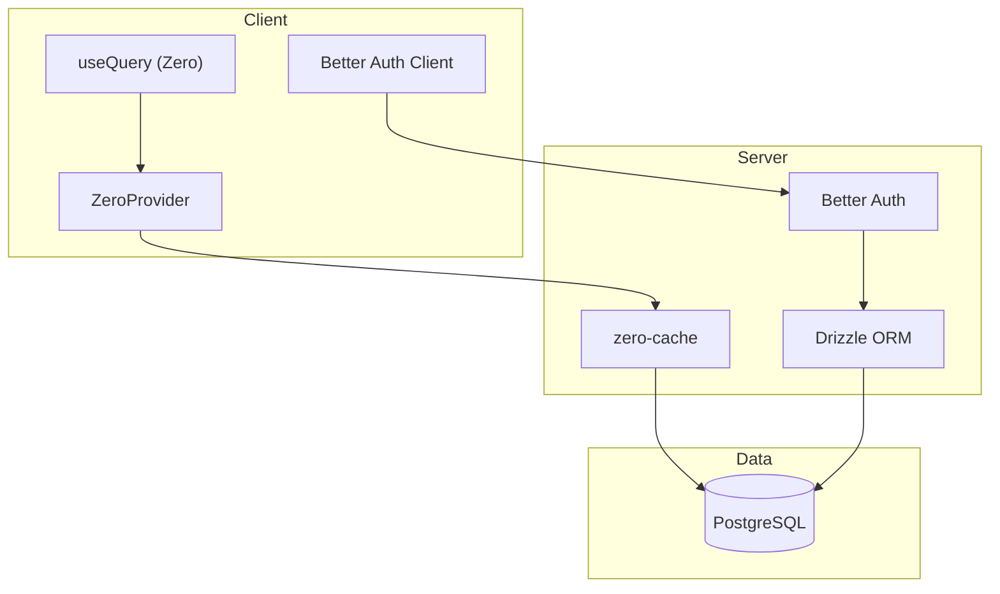
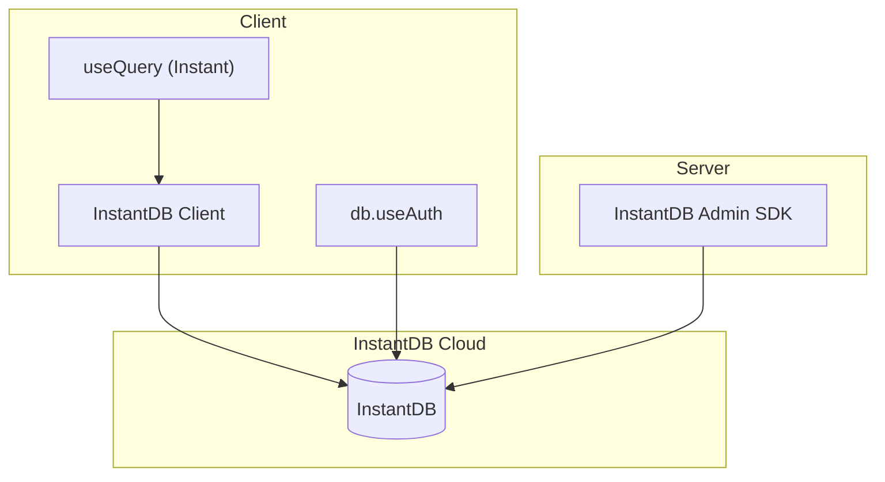

# Zero to InstantDB Migration Plan

This plan migrates the "bit" app from the current stack (Zero + Drizzle + Better Auth + PostgreSQL) to InstantDB as the single backend solution.

## Current Architecture



## Target Architecture



---

## Phase 1: InstantDB Setup

### 1.1 Install Dependencies

- Install `@instantdb/react` and `@instantdb/admin`
- Remove after migration: `@rocicorp/zero`, `drizzle-orm`, `drizzle-kit`, `drizzle-zero`, `better-auth`, `pg`

### 1.2 Create Schema - `instant.schema.ts`

Translate the Drizzle schema ([`schema.ts`](schema.ts)) to InstantDB format. Key entities:| Drizzle Table | InstantDB Entity | Notes ||--------------|------------------|-------|| `authUser` | `$users` | Built-in user entity || `githubOrganization` | `organizations` | || `githubRepo` | `repos` | || `githubPullRequest` | `pullRequests` | || `githubPrReview` | `prReviews` | || `githubPrComment` | `prComments` | || `githubPrFile` | `prFiles` | || `githubPrCommit` | `prCommits` | || `githubPrEvent` | `prEvents` | || `githubIssue` | `issues` | || `githubIssueComment` | `issueComments` | || `githubRepoTree` | `repoTrees` | || `githubRepoBlob` | `repoBlobs` | || `githubSyncState` | `syncStates` | |Relationships via `links`:

- `userOrganizations`: `$users` one-to-many `organizations`
- `userRepos`: `$users` one-to-many `repos`
- `orgRepos`: `organizations` one-to-many `repos`
- `repoPullRequests`: `repos` one-to-many `pullRequests`
- etc.

Index all fields used for filtering/ordering: `state`, `number`, `fullName`, `owner`, `githubPushedAt`, `githubUpdatedAt`, etc.

### 1.3 Create Permissions - `instant.perms.ts`

Row-level security using `data.ref`:

```typescript
export default {
  repos: {
    allow: {
      view: "auth.id in data.ref('user.id')",
      create: "auth.id != null",
      update: "auth.id in data.ref('user.id')",
      delete: "auth.id in data.ref('user.id')",
    }
  },
  // Similar for all entities...
}
```

### 1.4 Push Schema & Permissions

```bash
npx instant-cli push schema --app $INSTANT_APP_ID --token $INSTANT_ADMIN_TOKEN --yes
npx instant-cli push perms --app $INSTANT_APP_ID --token $INSTANT_ADMIN_TOKEN --yes
```

---

## Phase 2: Client Setup

### 2.1 Create Client DB - `src/lib/instantDb.ts`

```typescript
import { init } from '@instantdb/react'
import schema from '../instant.schema'

export const db = init({
  appId: import.meta.env.VITE_INSTANT_APP_ID,
  schema,
})
```

### 2.2 Create Admin DB - `src/lib/instantAdmin.ts`

```typescript
import { init } from '@instantdb/admin'
import schema from '../instant.schema'

export const adminDb = init({
  appId: process.env.INSTANT_APP_ID!,
  adminToken: process.env.INSTANT_ADMIN_TOKEN!,
  schema,
})
```

### 2.3 Configure Environment Variables

Add to `.env`:

- `VITE_INSTANT_APP_ID` (client-side, already have `INSTANT_APP_ID`)
- `INSTANT_ADMIN_TOKEN` (server-side, already configured)

---

## Phase 3: Auth Migration

### 3.1 Replace Better Auth with InstantDB OAuth

Update [`src/routes/__root.tsx`](src/routes/__root.tsx):

- Replace `authClient.useSession()` with `db.useAuth()`
- Replace `ZeroProvider` with InstantDB context

### 3.2 Update Login Page

Update [`src/pages/LoginPage.tsx`](src/pages/LoginPage.tsx):

- Replace `authClient.signIn.social({ provider: "github" })` with InstantDB OAuth
- InstantDB supports GitHub OAuth natively with custom scopes

### 3.3 Remove Better Auth Server

Delete [`src/lib/auth-server.ts`](src/lib/auth-server.ts) and [`src/routes/api/auth/$.ts`](src/routes/api/auth/$.ts)---

## Phase 4: Query Migration

### 4.1 Replace Zero Queries

Migrate each query from [`src/db/queries.ts`](src/db/queries.ts) to InstantDB format.| Zero Query | InstantDB Equivalent ||-----------|---------------------|| `queries.overview()` | `db.useQuery({ repos: { organization: {} } })` || `queries.repoWithPRsAndIssues(fullName)` | `db.useQuery({ repos: { $: { where: { fullName } }, pullRequests: {}, issues: {} } })` || `queries.repoWithPRFull({ fullName, prNumber })` | `db.useQuery({ repos: { $: { where: { fullName } }, pullRequests: { $: { where: { number: prNumber } }, files: {}, reviews: {}, comments: {}, commits: {}, events: {} } } })` |

### 4.2 Update Components

Files to update (replace `useQuery` from Zero with InstantDB):

- [`src/routes/index.tsx`](src/routes/index.tsx)
- [`src/routes/$owner/index.tsx`](src/routes/$owner/index.tsx)
- [`src/routes/$owner/$repo/pull.$number.tsx`](src/routes/$owner/$repo/pull.$number.tsx)
- [`src/routes/$owner/$repo/issues.$number.tsx`](src/routes/$owner/$repo/issues.$number.tsx)
- [`src/features/repo/RepoLayout.tsx`](src/features/repo/RepoLayout.tsx)
- [`src/features/repo/RepoCodeTab.tsx`](src/features/repo/RepoCodeTab.tsx)
- [`src/routes/$owner/$repo/tree.$branch.$.tsx`](src/routes/$owner/$repo/tree.$branch.$.tsx)
- [`src/routes/$owner/$repo/blob.$branch.$.tsx`](src/routes/$owner/$repo/blob.$branch.$.tsx)

---

## Phase 5: Backend Migration

### 5.1 Update Sync Endpoints

Replace Drizzle with InstantDB Admin SDK in:

- [`src/routes/api/github/sync/overview.ts`](src/routes/api/github/sync/overview.ts)
- [`src/routes/api/github/sync/$owner.$repo.ts`](src/routes/api/github/sync/$owner.$repo.ts)
- [`src/routes/api/github/sync/$owner.$repo.pull.$number.ts`](src/routes/api/github/sync/$owner.$repo.pull.$number.ts)

Use `adminDb.transact()` with `adminDb.tx.repos[id()].create({...})` instead of Drizzle inserts.

### 5.2 Update GitHub Client

Update [`src/lib/github-client.ts`](src/lib/github-client.ts) to use InstantDB admin SDK instead of pg Pool.

### 5.3 Update Webhook Handlers

Update all handlers in [`src/lib/webhooks/`](src/lib/webhooks/):

- Replace `drizzle(pool)` with `adminDb`
- Replace `db.insert().values()` with `adminDb.transact(adminDb.tx.entity[id].create())`
- Replace `db.update().set().where()` with `adminDb.transact(adminDb.tx.entity[id].update())`

---

## Phase 6: Cleanup

### 6.1 Remove Deprecated Files

- Delete `src/db/queries.ts`
- Delete `src/db/mutators.ts`
- Delete `src/db/schema.ts` (Zero generated)
- Delete `src/db/types.ts`
- Delete `src/lib/auth.ts`
- Delete `src/lib/auth-server.ts`
- Delete `src/routes/api/auth/$.ts`
- Delete `src/routes/api/zero/` directory
- Delete `schema.ts` (Drizzle)
- Delete `drizzle.config.ts`
- Delete `drizzle/` migrations folder
- Delete `docker/` (PostgreSQL)
- Delete `zero-schema.gen.ts`
- Delete `zero.db*` files

### 6.2 Remove Dependencies

```bash
bun remove @rocicorp/zero drizzle-orm drizzle-kit drizzle-zero better-auth pg @types/pg
```

### 6.3 Update Scripts in package.json

Remove:

- `dev:zero-cache`
- `dev:db-up`
- `dev:db-down`
- `dev:clean`
- `db:*` scripts
- `generate-zero-schema`
