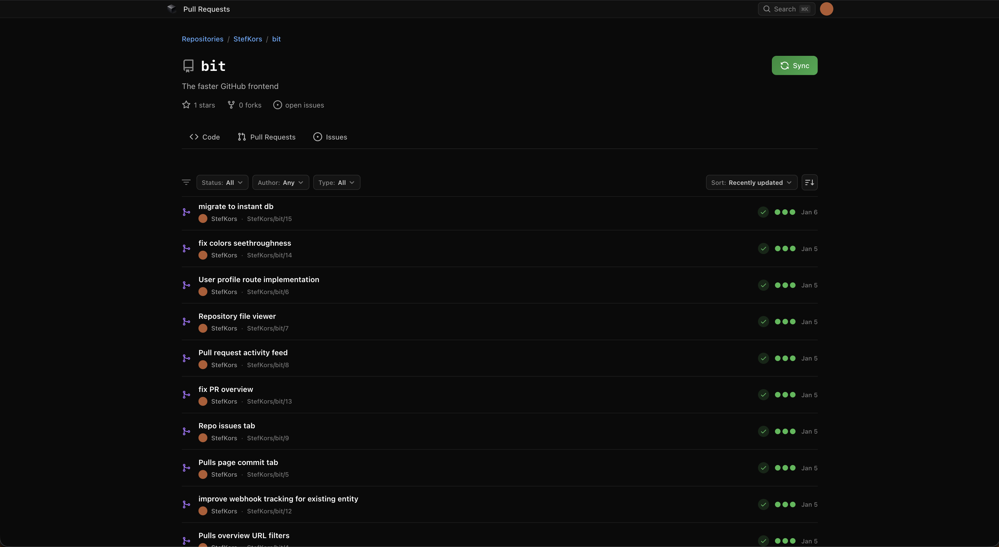

<p align="center">
  
  <h1 align="center">Bit</h1>
</p>

[Bit](https://github.com/StefKors/Bit) the faster GitHub frontend.

## Features

- **GitHub Integration**: View your organizations, repositories, and pull requests
- **Real-time Sync**: Data syncs via InstantDB for offline access
- **PR Viewer**: Full PR detail view with conversation, files changed, and diff viewer
- **Webhook Support**: Real-time updates via GitHub webhooks
- Diff viewer component from [pierre](https://diffs.com)



## Setup

### Environment Variables

Create a `.env` file with the following variables:

```bash
# InstantDB
INSTANT_APP_ID=your_instantdb_app_id
INSTANT_ADMIN_TOKEN=your_instantdb_admin_token

# GitHub Webhook Secret (for real-time updates)
GITHUB_WEBHOOK_SECRET=your_webhook_secret

# Public app URL used to register webhook callbacks
# Must be publicly reachable in production, e.g. https://your-domain.com
BASE_URL=http://localhost:5173

# Optional local override (default false)
# When false, webhook registration is skipped for localhost/private BASE_URL values
ALLOW_LOCAL_WEBHOOK_REGISTRATION=false
```

### InstantDB Setup

1. Go to [InstantDB Dashboard](https://www.instantdb.com/dash)
2. Create a new app
3. Copy the App ID to your `.env` file
4. Generate an Admin Token and add it to your `.env` file
5. Configure GitHub OAuth in InstantDB dashboard:
   - Go to Auth settings
   - Enable GitHub OAuth
   - Set redirect URL to `http://localhost:5173/`

### GitHub App Setup (for Webhooks)

To receive real-time updates, create a GitHub App:

1. Go to [GitHub Apps](https://github.com/settings/apps)
2. Create a new GitHub App
3. Set the Webhook URL to your API endpoint (e.g., `https://your-domain.com/api/github/webhook`)
4. Generate a Webhook Secret and add it to your `.env` as `GITHUB_WEBHOOK_SECRET`
5. Subscribe to events:
   - Pull requests
   - Pull request reviews
   - Pull request review comments
   - Issue comments
6. Set required permissions:
   - Pull requests: Read
   - Contents: Read
   - Metadata: Read

### Local Development Webhook Behavior

When running locally with `BASE_URL` pointing to localhost/private addresses, the app now
**skips webhook registration automatically** during sync. This avoids repeated GitHub API
errors like:

- `Validation Failed: url is not supported because it isn't reachable over the public Internet`

Why this happens:

- GitHub only accepts webhook callback URLs that are publicly reachable.
- Local URLs (`localhost`, `127.0.0.1`, `192.168.x.x`, etc.) are not reachable from GitHub.

How to enable webhook registration locally anyway:

1. Expose your local app publicly (for example using a tunnel URL).
2. Set `BASE_URL` to that public URL.
3. Optionally set `ALLOW_LOCAL_WEBHOOK_REGISTRATION=true` if you need to force local/private URL registration attempts.

### Running the App

```bash
# Install dependencies
bun install

# Push schema to InstantDB
bun run instant:push

# Run the development server
bun run dev
```

## Routes

| Route                        | Description                                            |
| ---------------------------- | ------------------------------------------------------ |
| `/`                          | Overview page - list of organizations and repositories |
| `/:owner/:repo`              | Repository home page                                   |
| `/:owner/:repo/pulls`        | Pull request list                                      |
| `/:owner/:repo/pull/:number` | Pull request detail view                               |

## API Endpoints

### Sync Endpoints

- `POST /api/github/sync/overview` - Sync organizations and repositories
- `POST /api/github/sync/:owner/:repo` - Sync pull requests for a repository
- `POST /api/github/sync/:owner/:repo/pull/:number` - Sync PR details (files, comments, reviews)
- `GET /api/github/rate-limit` - Get current GitHub API rate limit status

### Webhook Endpoint

- `POST /api/github/webhook` - Receive GitHub webhook events

## Rate Limiting

GitHub API has a limit of 5000 requests per hour for authenticated users. The app:

- Tracks remaining requests and displays them in the UI
- Shows a warning when rate limit is low (<100 requests)
- Stores sync state to avoid unnecessary re-fetching

## Tech Stack

- **Frontend**: React + Vite + TypeScript
- **Routing**: TanStack Router
- **State**: InstantDB (offline-first sync)
- **Styling**: CSS Modules
- **Backend**: Hono + TanStack Start
- **Database**: InstantDB
- **Auth**: InstantDB with GitHub OAuth
